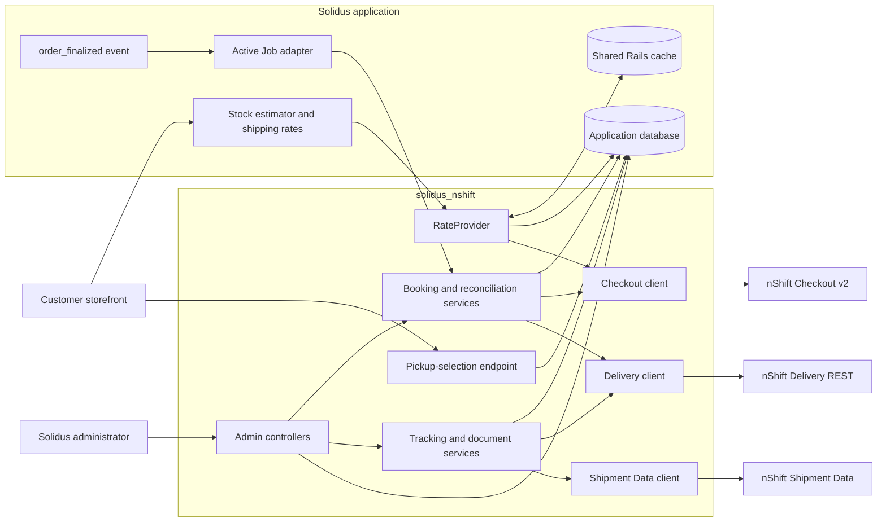
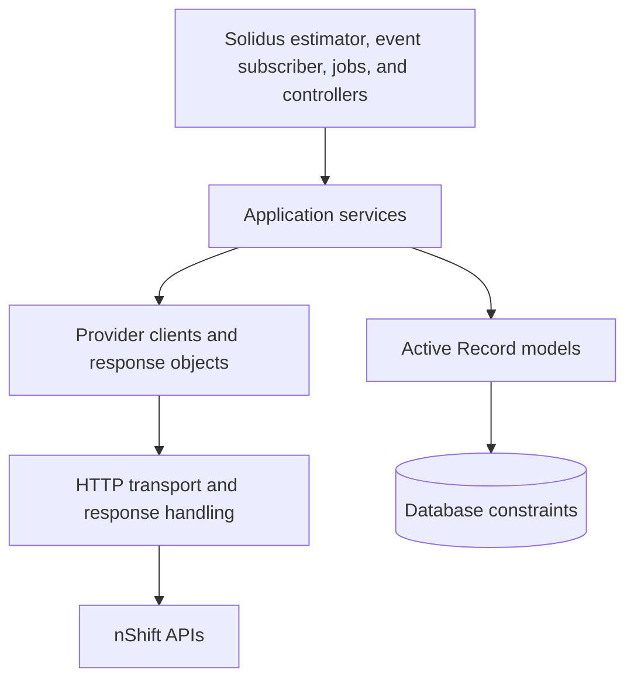
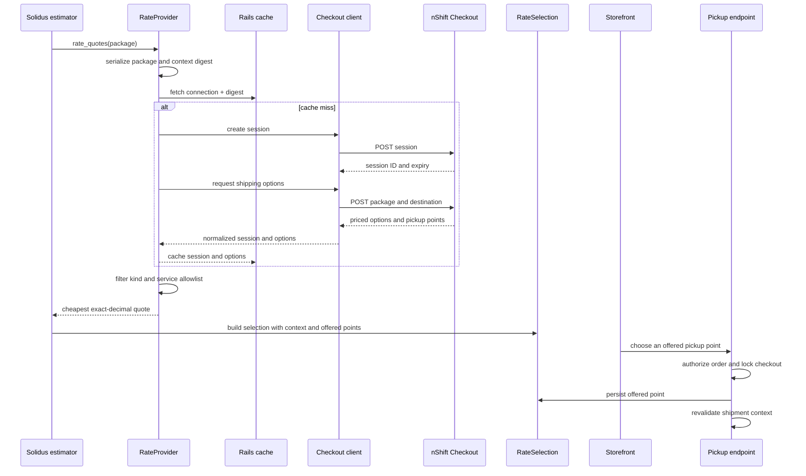
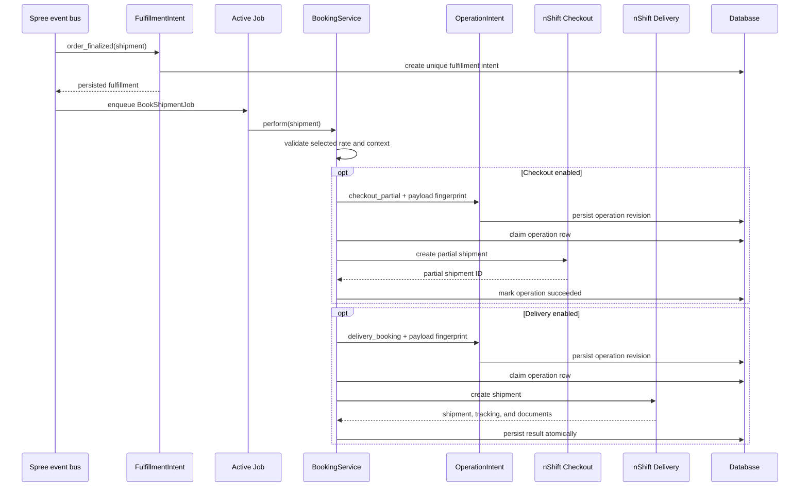
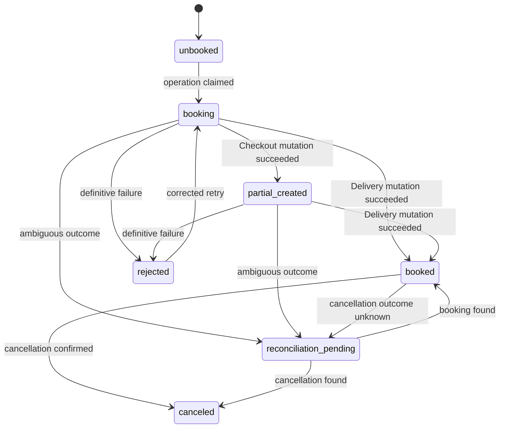
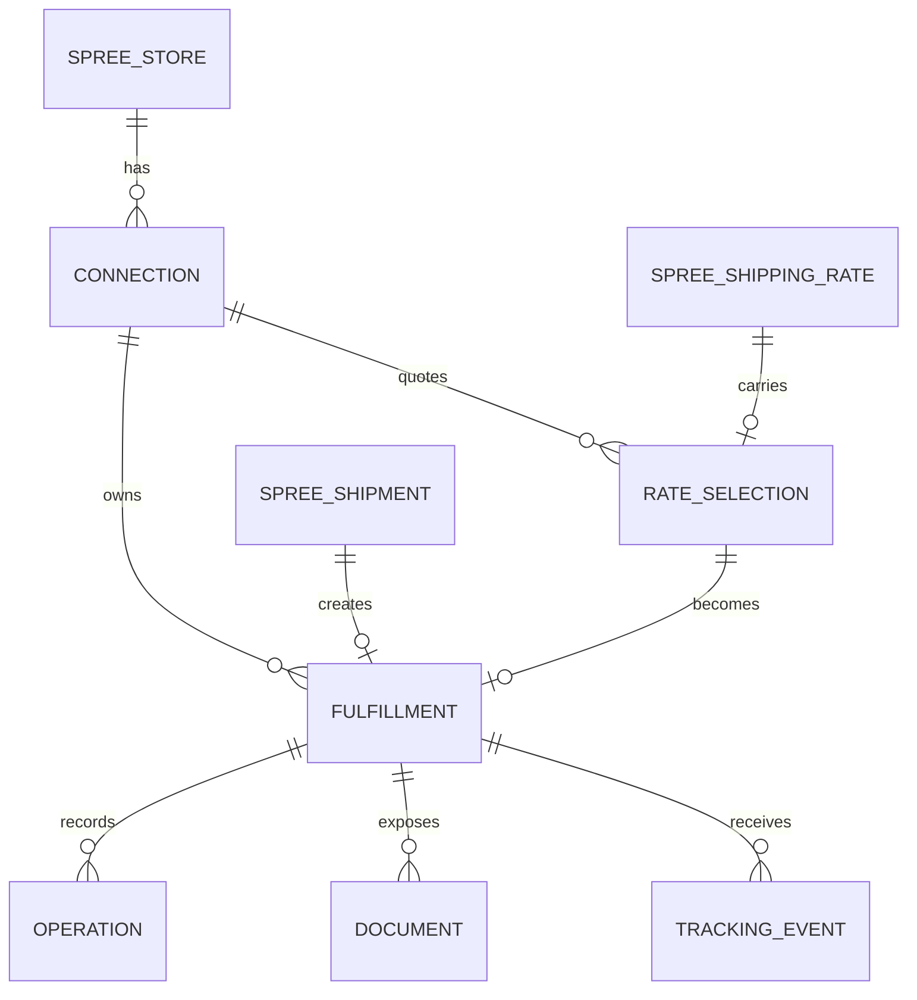
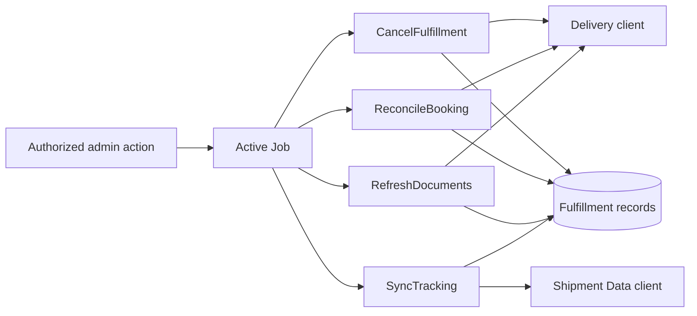

# Architecture and code map

This page describes how `solidus_nshift` fits into a Solidus application. Operational recovery belongs in the [operations guide](operations.md); provider access and release evidence belong in the [test-account checklist](sandbox-certification.md).

## System context

The engine separates checkout quoting, fulfillment mutations, and tracking because nShift exposes them as different products with different credentials and failure modes.

Solidus order authorization protects pickup selection; admin actions use the normal Solidus admin abilities.

## Source layout

| Path | Responsibility |
| --- | --- |
| `lib/solidus_nshift.rb` | Public entry point, configuration, value objects, HTTP handling, OAuth, and provider clients |
| `lib/solidus_nshift/engine.rb` | Rails engine, parameter filtering, admin menu, model extensions, estimator extension, and event subscription |
| `lib/solidus_nshift/checkout/` | Checkout sessions, package requests, option normalization, and service points |
| `lib/solidus_nshift/delivery/` | Delivery REST client and validated shipment/document responses |
| `lib/solidus_nshift/shipment_data/` | Shipment lookup, event normalization, and tracking client |
| `app/models/solidus_nshift/` | Connections and durable checkout, fulfillment, mutation, document, and tracking state |
| `app/services/solidus_nshift/` | Workflow orchestration, payload construction, validation, persistence, and reconciliation |
| `app/jobs/solidus_nshift/` | Queue entry points and retry policy |
| `app/controllers/solidus_nshift/` | Storefront pickup selection and authorized admin actions |
| `db/migrate/` | Tables, uniqueness rules, check constraints, and operation revisions |
| `spec/` | Provider contract fixtures, service behavior, requests, integration cases, and database concurrency |

Runtime dependencies point inward toward small provider clients and persisted records. Provider clients do not know about Solidus models.

## Checkout quoting

The estimator extension adds nShift rates alongside rates returned by Solidus. It serializes the package once, uses a digest of destination, contents, units, store, connection, shipment, and stock location as the cache key, and persists the provider context with the resulting shipping rate.

Each Solidus shipping method yields at most one nShift rate. Shops that expose both home and pickup delivery should configure separate shipping methods. Currency mismatch, malformed data, authentication failure, or transport failure returns no nShift rate; other Solidus shipping methods remain available.

## Fulfillment booking

Finalizing an order creates the local fulfillment intent before the job is enqueued. The job validates that the chosen rate is complete and still matches the shipment, then runs the enabled provider mutations in order.

An operation has a kind, revision, request fingerprint, status, attempt count, and provider identifiers. A succeeded operation is idempotent. An `in_progress` or `unknown` operation cannot be dispatched again. A definitive rejection may create a new revision, but only with a new deliberate attempt and a matching persisted fingerprint.

## Fulfillment states

Timeouts, connection loss, malformed mutation responses, HTTP 408, and provider 5xx responses are ambiguous once dispatch may have happened. Delivery reconciliation searches shipment history by the persisted merchant reference. It adopts an exact match but never treats “not found” as permission to create another shipment. Checkout partial shipments require manual verification because the adapter has no safe lookup for them.

## Persistence model

Database constraints enforce one selection per shipping rate, one fulfillment per shipment and selection, unique provider resources within a connection, ordered operation revisions, unique document IDs per fulfillment, and idempotent tracking events. Model validations mirror those rules for useful application errors; the database remains the concurrency boundary.

## Post-booking flows

- Cancellation uses the same persisted-operation rules as booking.
- Document refresh stores metadata only. The authorized download endpoint validates shipment and document identifiers and serves the provider response without following stored URLs.
- Tracking first locates the shipment by the stable order reference, then upserts events by external ID. Terminal tracking states do not regress.
- Queue failures emit `solidus_nshift.enqueue_failed`. Provider requests emit `solidus_nshift.request`. Neither payload includes credentials, addresses, tokens, label data, or job arguments.

## Configuration seams

`SolidusNshift.configure` exposes the small set of runtime seams needed by host applications and tests:

| Setting | Default | Purpose |
| --- | --- | --- |
| `cache` | `Rails.cache`, then process memory | OAuth token and checkout request caching |
| `transport_factory` | `Http::NetHttpTransport` | HTTP construction and test substitution |
| `parcel_builder` | One parcel from the Solidus package | Merchant-specific parcel grouping |
| `book_shipment_job` | `BookShipmentJob` | Host-specific booking queue class |
| `sync_tracking_job` | `SyncTrackingJob` | Host-specific tracking queue class |
| `clock`, `sleeper`, `logger` | Ruby/Rails defaults | Deterministic time, backoff, and structured logging |
| `rate_cache_ttl` | 300 seconds | Checkout quote cache lifetime |

Production applications with more than one process must replace the memory fallback with a shared cache. Custom parcel builders must return positive weights in kilograms and positive integer copy counts.

## Scope boundaries

This release does not implement manifests, consolidated or return shipments, Shipment Server, Delivery Cloud, dangerous goods, or customs/non-EU shipment data. A service that needs one of those payloads must not be enabled until its contract, fixtures, validation, and test-account evidence have been added.

Continue with the [operations guide](operations.md), [API decision record](adr/0001-nshift-api-products.md), or [migration guide](migration-from-spree-unifaun.md).
