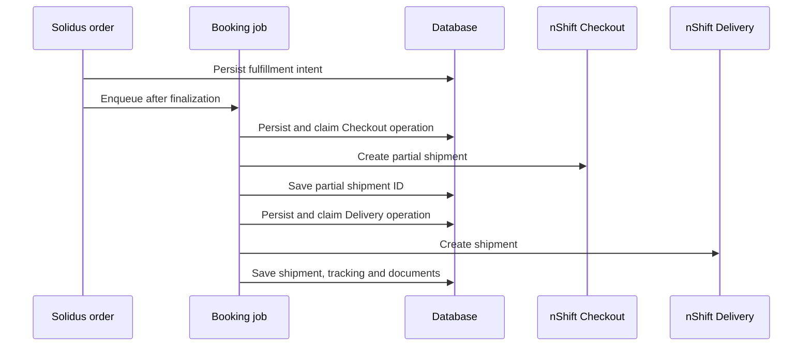

# How the integration works

The gem has three nShift clients: Checkout for quotes and pickup options, Delivery for booking and labels, and Shipment Data for tracking. Each uses its own account configuration. [ADR 0001](adr/0001-nshift-api-products.md) explains the product choices and links to the provider contracts.

## Checkout

`RateEstimatorExtension` adds rates to the application's configured Solidus stock estimator. Each nShift shipping method returns its cheapest eligible option. Configure separate methods to offer both home delivery and pickup.

`PackageSerializer` builds the request from the destination, package weight and dimensions, order currency, and cart total. A digest also ties the quote to its store, connection, remote Checkout connection, shipment, stock location, and item quantities.

`RateProvider` shares cached options between matching requests. It checks the connection's store and active status and caps the cache lifetime at the session expiry. Saving connection settings invalidates cached quotes. Price parsing uses `BigDecimal` from the JSON boundary.

A saved `RateSelection` contains the session, option, price, context digest, and offered pickup points. The pickup endpoint authorizes the order, locks it, and validates the choice and current package before committing. A JSON request needs either a matching order token or normal Rails CSRF protection.

Provider failures return no nShift rates. Other shipping methods remain available.

## Booking and recovery

Only enabled capabilities run. Each mutation has an operation kind, revision, request fingerprint, attempt count, and outcome. Claiming uses a row lock; database uniqueness constraints protect the intent and provider IDs. HTTP calls take place outside these short database transactions.

A rejected request may be tried in a new revision. An in-progress or unknown request must be reconciled before another dispatch. Net::HTTP retries are disabled so they cannot bypass these rules.

Delivery reconciliation searches by the stable merchant reference. An exact match can be adopted locally. No match leaves the operation unresolved; it does not prove the original request failed. Ambiguous Checkout partial shipments require manual provider verification because the adapter has no safe lookup for them.

See the [operations guide](operations.md) for states, queue failures, and recovery steps.

## Tracking and labels

Tracking first locates a Shipment Data UUID by order reference in a bounded search window. Imports run under a fulfillment lock, upsert event IDs, and retain terminal statuses. The current status is selected in SQL, so imports do not load the entire event history into Ruby.

Labels are stored as document metadata, not binary copies. Downloads use the saved shipment and document IDs, enforce a response-size limit, and check PDF headers. Provider document URLs are not followed.

Admin lists and actions apply the host application's CanCan record permissions. The screens are loaded only with `solidus_backend`; core-only installations need their own operator interface.

## Source map

| Path | Purpose |
| --- | --- |
| `lib/solidus_nshift/` | Clients, value objects, HTTP, OAuth, configuration and engine hooks |
| `app/models/solidus_nshift/` | Connections, quotes, fulfillments, operations, documents and tracking events |
| `app/services/solidus_nshift/` | Quoting, validation, payloads, booking and recovery |
| `app/jobs/solidus_nshift/` | Active Job entry points and retry policy |
| `app/controllers/solidus_nshift/` | Pickup selection |
| `lib/controllers/backend/`, `lib/views/backend/` | Optional legacy admin screens |
| `db/migrate/` | Tables, foreign keys, uniqueness and check constraints |
| `spec/` | Synthetic provider contracts and application behavior |

## Application configuration

`SolidusNshift.configure` accepts these settings:

| Setting | Default | Use |
| --- | --- | --- |
| `cache` | `Rails.cache`, then bounded process memory | Share OAuth tokens and quote responses |
| `transport_factory` | `Http::NetHttpTransport` | Customize HTTP transport |
| `parcel_builder` | One parcel from the shipment | Group parcels for the merchant's packing process |
| `book_shipment_job`, `sync_tracking_job` | Built-in jobs | Choose application-specific queue classes |
| `clock`, `sleeper`, `logger` | Ruby/Rails defaults | Control time, backoff and logging |
| `rate_cache_ttl` | 300 seconds | Limit quote reuse |

Multi-process stores should use a shared cache. The fallback holds at most 1,000 entries and is intended for local use. Custom parcel builders return positive weights in kilograms and positive integer copy counts.

## Current limits

This alpha does not implement manifests, returns, consolidated shipments, Shipment Server, Delivery Cloud, dangerous goods, or customs declarations. Services requiring those fields need additional provider contracts, implementation and test-account evidence.

Synthetic tests cannot verify carrier service mappings, account entitlements, EDI behavior or physical label output. Complete the [test-account checklist](sandbox-certification.md) before using an enabled product in production.
